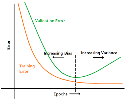

## Intelligence Artificielle (IA), Machine Learning, Deep Learning & NLP - Q/A

### Q1: Quelle est la différence entre IA, Machine Learning et Deep Learning ?
**Réponse:**
L'***IA*** est le domaine général visant à créer des systèmes capables d'effectuer des tâches intelligentes. Le ***Machine Learning*** est une sous-catégorie de l'IA où les modèles apprennent à partir de données. Le ***Deep Learning*** est une branche du ML utilisant des réseaux de neurones profonds pour traiter des données complexes.
## Artificial Intelligence (AI) Subdomains

* **Artificial Intelligence (AI):** The **general field** aimed at creating systems capable of performing intelligent tasks.
* **Machine Learning (ML):** A **sub-category of AI** where models learn to perform tasks directly from data without being explicitly programmed.
* **Deep Learning (DL):** A **branch of ML** that uses deep neural networks (multiple layers) to process complex data and perform tasks like image recognition or natural language processing.
* **Generative AI (GenAI):** A **subset of DL** focused on creating new content (text, images, audio, etc.) that is similar to the data it was trained on.
    * **Key Distinction:** While most traditional ML models are **discriminative** (classifying or predicting), GenAI models are **generative** (creating new content).

**Q: Difference between AI, ML, and DL?**  
- **AI**: Broad field for building intelligent systems.  
- **ML**: Subset of AI, models learn patterns from data.  
- **DL**: Subset of ML using deep neural networks.

**Q: Types of ML?**  
- **Supervised**: Trained on labeled data.  
- **Unsupervised**: Finds structure in unlabeled data.  
- **Reinforcement Learning**: Learns from feedback in an environment.The agent receives rewards for correct actions and penalties (negative rewards) for incorrect ones.
- **Semi-Supervised Learning**: Uses a small amount of labeled data combined with a large amount of unlabeled data during training. 

- **Self-Supervised Learning (SSL)**: A form of unsupervised learning where the model generates its own pseudo-labels from the unlabeled data (often by masking parts of the input and having the model predict the missing parts), allowing it to then be trained using supervised methods. BERT is a common example.

### The Learning Process: Loss Function & Bias-Variance Trade-Off
When an ML model learns, it's essentially trying to solve an optimization problem. These two concepts are at the heart of that process.

- **Loss Function (or Cost Function)**
https://www.youtube.com/watch?v=AUmZGGm6quw&t=4s

- •	What it is: A mathematical function that measures how "wrong" the model's prediction is compared to the actual truth. It quantifies the error for a single data point.
- **Common Examples:**
- - ***Mean Squared Error (MSE)***: Used for regression tasks (predicting a number). It penalizes larger errors more heavily.
- - ***Cross-Entropy Loss***: Used for classification tasks (predicting a category). It measures the difference between two probability distributions.

#### Bias-Variance Trade-Off
**Bias:** Error due to a model's overly simplistic assumptions. A high-bias model is like a student who didn't study enough—it oversimplifies the problem and performs poorly even on the training data. This leads to **Underfitting**.

•	Example: Trying to fit a straight line (a simple model) to a complex, curved data pattern.

**Variance**: Error due to a model's excessive sensitivity to small fluctuations in the training data. A high-variance model is like a student who memorizes the textbook without understanding the concepts—it performs perfectly on the training data but fails on anything new. This leads to **Overfitting**.

•	Example: A model that learns the training data points perfectly, including all the noise, and cannot generalize.

##### The Trade-Off: You cannot simultaneously minimize both bias and variance.
o	**Simple Model:** High Bias, Low Variance (Underfits)

o	**Complex Model:** Low Bias, High Variance (Overfits)

o	The goal is to find the optimal model complexity that balances the two, achieving a low total error.
The Central Problem: Handling Overfit Models
Overfitting is when a model learns the training data too well, including its noise and random fluctuations, and therefore performs poorly on new, unseen data (it fails to generalize).
The Bias-Variance Trade-Off tells us that overfitting is a high-variance problem.

### How to Handle Overfitting:
1.	Get More Data: The most effective method. With more data, it's harder for the model to memorize the noise; it's forced to learn the generalizable patterns.
2.	Simplify the Model:
o	For a neural network (DL): Use fewer layers or fewer neurons per layer.
o	For a decision tree: Reduce the maximum depth of the tree.
3.	Regularization: A technique that explicitly discourages model complexity by adding a penalty to the Loss Function.
L1 (Lasso): Can drive some feature weights to zero, effectively performing feature selection.
L2 (Ridge): Shrinks all feature weights towards zero but rarely eliminates them completely.
4.	 Dropout (Specific to DL): Randomly "dropping out" (turning off) a percentage of neurons during training. This prevents neurons from becoming overly reliant on each other and forces the network to learn more robust features.
5.	Early Stopping: During training, you monitor the model's performance on a validation set. You stop training as soon as the validation performance starts to get worse, preventing the model from over-optimizing on the training data.
 

6.	Cross-Validation: A technique (like k-fold cross-validation) to robustly evaluate a model and its hyperparameters, ensuring that the performance is consistent across different splits of the data and not just lucky for one particular split.

### Q2: Expliquez le sur-apprentissage (overfitting) et comment le prévenir.
**Réponse:**
Le sur-apprentissage se produit quand un modèle apprend trop bien les détails du jeu de données d'entraînement, au détriment de sa capacité à généraliser. On peut le prévenir par la régularisation, la validation croisée, l'augmentation des données, ou l'arrêt précoce.

### Q3: Qu'est-ce qu'un réseau de neurones convolutionnel (CNN) ?
**Réponse:**
Un CNN est un type de réseau de neurones utilisé principalement pour le traitement d'images. Il utilise des couches de convolution pour extraire des caractéristiques locales.

### Q4: Qu'est-ce que le NLP et citez des tâches courantes ?
**Réponse:**
Le NLP (Natural Language Processing) est le traitement automatique du langage naturel. Tâches courantes : classification de texte, analyse de sentiment, traduction automatique, génération de texte, question-réponse.

### Q5: Expliquez le concept de word embeddings.
**Réponse:**
Les word embeddings sont des représentations vectorielles de mots qui capturent leur signification sémantique. Exemples : Word2Vec, GloVe, FastText.

**Q: Key challenges in NLP?**  
- Ambiguity, context understanding, long-term dependencies, bias in data.

**Q: What are Transformers?**  
- Architecture introduced in *Attention is All You Need (2017)*.  
- Uses attention mechanisms to handle long dependencies efficiently.  
- Basis of modern LLMs.
