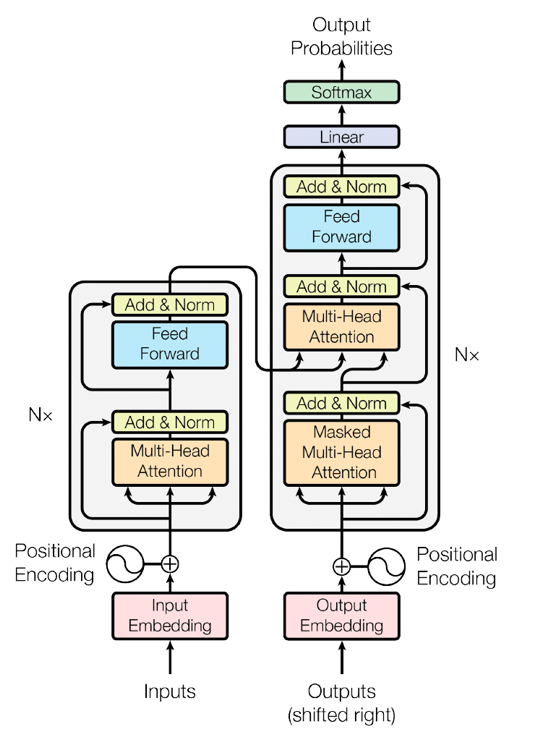

# Modèles Génératifs et Discriminatifs

## 1. Discriminative vs Generative Models

| Type             | Objectif | Exemple |
|-----------------|----------|---------|
| **Discriminative** | Apprendre la frontière entre classes et prédire labels | Logistic Regression, SVM, Classifieurs CNN/RNN |
| **Generative**     | Apprendre la distribution des données pour générer de nouvelles instances réalistes | GANs, VAE, PixelCNN |

**Résumé** :  
- Discriminative → "Quelle est la classe de cette donnée ?"  
- Generative → "Comment générer des données réalistes similaires à celles observées ?"
Discriminative Model: Input -> Class Prediction
Generative Model: Noise -> Generator -> Fake Data -> Discriminator

---

## 2. GANs (Generative Adversarial Networks)

- Composés de deux réseaux :  
  1. **Generator (G)** : génère de fausses données à partir d’un bruit latent.  
  2. **Discriminator (D)** : distingue vraies données vs données générées.
GAN: Noise -> Generator -> Fake Data -> Discriminator -> Loss -> Backprop
### Mode Collapse
- Problème courant où le **Generator produit toujours le même type de sortie**, perdant la diversité.  
- Cause : déséquilibre d’entraînement entre Generator et Discriminator.  
- Solutions : modifications de la loss, architectures stabilisantes, techniques comme **mini-batch discrimination**.

---

## 3. Autoencoders

- Composés de trois parties :  
  1. **Encoder** : transforme les données d’entrée en une **représentation compacte (espace latent)**.  
  2. **Espace latent** : vecteur dense qui capture les caractéristiques essentielles.  
  3. **Decoder** : reconstruit les données d’entrée à partir de l’espace latent.
Autoencoder: Input -> Encoder -> Latent Space -> Decoder -> Reconstruction

**Utilisations** : réduction de dimension, génération de données, denoising.

---

## 4. VAE (Variational Autoencoder)

- Variante probabiliste des Autoencoders.  
- Espace latent est représenté par une **distribution (μ, σ)** au lieu d’un point fixe.  
- **Reparameterization trick** : permet le backpropagation via échantillonnage.  
- Génère des échantillons diversifiés tout en garantissant un espace latent structuré.
```
VAE: Input -> Encoder -> Latent Distribution -> Sampling -> Decoder -> Reconstruction
```

---

## 5. Stabilité des GANs vs Convergence

- **GANs** : difficile à entraîner, peut diverger ou tomber en **mode collapse**.  
- **VAE et Autoencoders** : plus stables, convergence plus facile grâce à une fonction de reconstruction claire.  
- **Astuce pour GANs** : équilibrer le learning rate, utiliser normalisation, architectures stabilisantes (WGAN, LSGAN).


## Generative AI, Transformers, RAG, Finetuning, LLM - Q/A

### Q1: Qu'est-ce que l'IA générative ?
**Réponse:**
L'IA générative crée de nouveaux contenus (texte, images, audio) à partir de données existantes, souvent via des modèles comme les GANs ou les LLMs.

### Q2: Expliquez le principe des transformers.
**Réponse:**
Les transformers sont des architectures de réseaux de neurones basées sur l'attention, permettant de traiter efficacement des séquences. Ils sont à la base des modèles comme BERT, GPT, T5.
Ils se déclinent en trois architectures principales :
- **Encodeur** : utilisé pour l'analyse (ex : BERT)
Breaks down input text into tokens (like words).Uses self-attention layers to create hidden states that capture the meaning and context of the text.Multiple layers of the encoder are used.
- **Décodeur** : utilisé pour la génération (ex : GPT)
- **Encodeur-Décodeur** : utilisé pour la traduction ou le résumé (ex : T5, BART)

### Composants clés d'un transformer
#### 1. Embeddings (Représentations Vectorielles)
- **Token** : unité de texte (mot, sous-mot, caractère) transformée en vecteur
- **Embedding** : représentation vectorielle des tokens which capture the semantic meaning of words.
 vecteur dense représentant des objets (mots, images, etc.) dans un espace continu.
    - Permet aux modèles d’apprendre des relations sémantiques.
    - Exemple : `king - man + woman ≈ queen` dans un espace de mots.
- Transformer = Encoder + Decoder
#### 2. Positional Encoding (Encodage Positionnel)
- Les Transformers ne traitent pas les séquences dans l’ordre.  
- Positional Encoding ajoute l’information de position à chaque embedding pour que le modèle connaisse l’ordre des tokens.
```
PE(pos, 2i)   = sin(pos / 10000^(2i/d_model))
PE(pos, 2i+1) = cos(pos / 10000^(2i/d_model))
```

#### 3. Mécanisme d’Attention
- **Multi-Head Self-Attention/ Self-attention** :  It allows tokens to communicate with other tokens, capturing contextual information and relationships between words. 
permet au modèle de pondérer l'importance de chaque token
- - Step 1: Query, Key, and Value Matrices : Each token's embedding vector is transformed into three vectors: Query (Q), Key (K), and Value (V).
Query (Q) "find more information about"
Key (K) It represents the possible tokens the query can attend to.
Value (V) Once we matched the appropriate search term (Query) with the relevant results (Key), we want to get the content (Value) of the most relevant pages.
- - Step 2: Multi-Head Splitting
Query, key, and Value vectors are split into multiple heads, Each head processes a segment of the embeddings independently, capturing different syntactic and semantic relationships. --> parallel learning
- - Step 3: Masked Self-Attention

### Types d’Attention
- **Self-Attention (Encoder)** : chaque token regarde les autres tokens de la même séquence d’entrée.  
- **Masked Self-Attention (Decoder)** : empêche le modèle de regarder les tokens futurs lors de la génération.  
- **Cross-Attention (Encoder-Decoder)** : les tokens du Decoder regardent les embeddings produits par l’Encoder pour obtenir des informations pertinentes.

#### 4. Feed Forward Network (FFN)
- **Feedforward layers / MLP (Multilayer Perceptron) Layer** : - Couches linéaires appliquées à chaque token individuellement,  the goal of the MLP is to refine each token's representation.
#### 5. Residual Connections & LayerNorm
- **Residual Connections** : ajoutent l’entrée originale à la sortie pour faciliter l’apprentissage.  
- **Layer Normalization** : stabilise et accélère l’entraînement.
#### 6. Architecture Empilée (Stacked Layers)
- Plusieurs blocs Transformer identiques sont empilés pour former l’Encoder et le Decoder.  
- Chaque bloc comprend : Multi-Head Attention → FFN → Residual + LayerNorm.

#### 7. Couches Finales (Projection)
- **Linear Projection + Softmax** :  The final linear and softmax layers transform the processed embeddings into probabilities, enabling the model to make predictions about the next token in a sequence.
#### 8. Masques (Masks)
- **Padding Mask** : ignore les tokens de remplissage.  
- **Look-Ahead / Causal Mask** : empêche de regarder les tokens futurs dans le Decoder pour les tâches autoregressives.


### Qu'est-ce qu'un LLM ?
Un LLM (Large Language Model) est un modèle de deep learning entraîné sur de vastes corpus textuels pour comprendre et générer du langage naturel. Il utilise l'architecture des transformers.

### Transformers vs RNN
- **RNN** : Séquentiel (un token après l’autre), mémoire limitée, difficile à paralléliser
Moins de paramètres   
- **Transformers** : Parallèle (tous les tokens simultanément), capturent mieux les dépendances longues, plus efficaces pour le NLP moderne

### Q3: Qu'est-ce que le Retrieval-Augmented Generation (RAG) ?
**Réponse:**
RAG combine la génération de texte par LLM avec la récupération d'informations à partir d'une base documentaire, améliorant la pertinence et la factualité des réponses.

### Q4: Qu'est-ce que le finetuning d'un LLM ?
**Réponse:**
Le finetuning consiste à adapter un modèle pré-entraîné à une tâche ou un domaine spécifique en le ré-entraînant sur des données ciblées.

### LLM généraliste vs finetuned
- **LLM généraliste** : pré-entraîné sur des données variées, capable de répondre à des tâches générales
- **LLM finetuned** : ré-entraîné sur des données spécifiques pour une tâche ou un domaine précis (ex : classification, Q/A, chatbot métier)

### Méthodes de finetuning
- **Full finetuning** : tous les paramètres du modèle sont mis à jour
- **PEFT (Parameter Efficient Fine-Tuning)** : seules certaines parties du modèle sont adaptées, exemple :
    - **LoRA (Low-Rank Adaptation)** : insère des matrices de faible rang dans les couches d'attention
    - **Entête de classification** : seule la dernière couche (classifier head) est entraînée


## Exemple de code : LoRA avec transformers
```python
from transformers import AutoModelForCausalLM, AutoTokenizer
from peft import LoraConfig, get_peft_model, TaskType
import torch

# 1. Charger le modèle pré-entraîné
model_name = "gpt2"
model = AutoModelForCausalLM.from_pretrained(model_name)
tokenizer = AutoTokenizer.from_pretrained(model_name)

# 2. Configurer LoRA
lora_config = LoraConfig(
    r=8,                 # rang faible
    lora_alpha=16,       # facteur de mise à l’échelle
    target_modules=["c_attn"],  # les modules à adapter
    lora_dropout=0.1,
    task_type=TaskType.CAUSAL_LM
)

# 3. Appliquer LoRA au modèle
model = get_peft_model(model, lora_config)

# 4. Préparer les données
texts = ["Hello world", "Fine-tuning LoRA is fun"]
inputs = tokenizer(texts, return_tensors="pt", padding=True, truncation=True)

# 5. Définir optimiseur et loss
optimizer = torch.optim.AdamW(model.parameters(), lr=1e-4)
loss_fn = torch.nn.CrossEntropyLoss()

# 6. Boucle d’entraînement simplifiée
model.train()
for epoch in range(3):
    optimizer.zero_grad()
    outputs = model(**inputs, labels=inputs["input_ids"])
    loss = outputs.loss
    loss.backward()
    optimizer.step()
    print(f"Epoch {epoch+1}, Loss: {loss.item():.4f}")

# 7. Évaluation simple
model.eval()
with torch.no_grad():
    outputs = model.generate(tokenizer("Fine-tuning ", return_tensors="pt")["input_ids"], max_length=20)
    print(tokenizer.decode(outputs[0]))
```


### Q5: Citez des applications des LLMs en entreprise.
**Réponse:**
Chatbots, assistants virtuels, génération de rapports, recherche documentaire, automatisation de tâches, analyse de sentiment.

## GENAI

**Q: What is Generative AI?**  
- Branch of AI that generates new content (text, image, audio, code).  
- Examples: ChatGPT, Stable Diffusion, MidJourney.

**Q: What is a Language Model (LM) vs Large Language Model (LLM)?**  
- **LM**: Predicts the next token in a sequence.  
- **LLM**: Scaled-up LM with billions of parameters, trained on massive corpora, usually Transformer-based.

**Q: What is RAG (Retrieval-Augmented Generation)?**  
- Combines retrieval (fetch knowledge from database) + generation (LLM creates response).  
- Helps reduce hallucinations.

**Q: What is Fine-tuning in LLMs?**  
- Process of adapting a pre-trained model to a domain/task.  
- Techniques: Full fine-tuning, LoRA, PEFT, instruction tuning, RLHF.

**Q: Evaluation metrics for GenAI?**  
- Text: BLEU, ROUGE, Perplexity.  
- Image: FID, IS.  
- Human feedback increasingly important.
---
