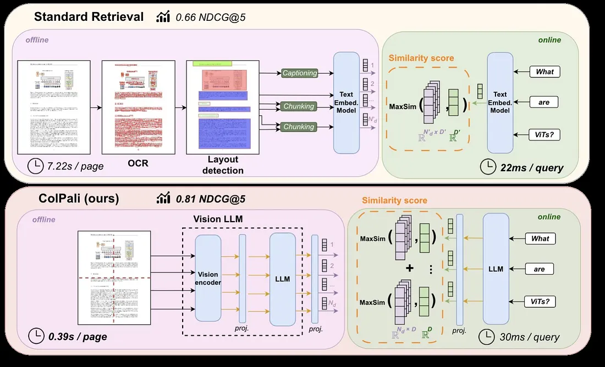
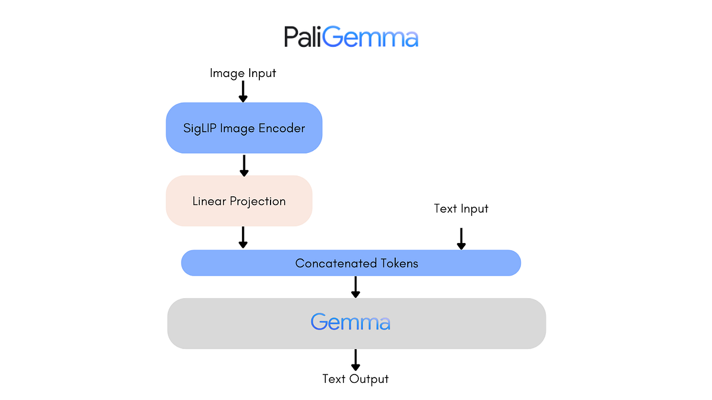

# Introduction 

**RAG (Retrieval-Augmented Generation)**
→ Documents are converted into text, and an AI is asked to read that text.

**ColPali**
→ The AI looks directly at images of the pages, like a human, without using OCR.

The goal of both methods is the same: to find the relevant passages so that an LLM (ChatGPT, Gemma, Llama, etc.) can then answer a question.

But their way of working is very different.

## Un pipeline RAG se compose de :

## Pipeline d’un RAG classique

1. **Extraction de contenu** : OCR, segmentation, détection de layout.  
2. **Prétraitement** : normalisation, nettoyage, chunking.  
3. **Embedding** : encodage des textes en vecteurs.  
4. **Alignement sémantique** : calcul de similarité (cosine, dot-product), optimisé en ANN (FAISS, HNSW).  
5. **Récupération** : kNN dans un index vectoriel.  
6. **Augmentation** : injection des passages dans un LLM.

Tout repose sur la transformation **texte → vecteur**, et dépend fortement de la qualité de l’OCR.

---

## ColPali
ColPali utilise des **modèles de vision** pour comprendre directement les images des pages, sans OCR.

ColPali combine :

1. **Un encodeur visuel (PaliGemma Vision Tower ou SigLIP)**  
   - Représentation visuelle : patchification + embeddings  
   - Une image de document \( I \) de taille \( H \times W \times 3 \) est projetée en une grille de patches.  
   - L’image n’est pas résumée : elle est représentée par **une collection de vecteurs**.  
   - Chaque patch de taille \( p \times p \) est mappé à un vecteur de dimension \( d \)via une couche linéaire apprise.

2. **Un encodeur langage (Llama / Gemma)**  
   -  Représentation textuelle : Tokenisation + embedding  
   - Le texte est découpé en tokens, chaque token étant projeté dans un vecteur de dimension \( d \).

3. **Une projection cross-modale / multimodale**  
   - Projection linéaire pour aligner espace visuel et espace textuel dans un même espace vectoriel.

4. **Une interaction tardive (Late Interaction, style ColBERT)**  
   - Comparaison efficace efficace entre les vecteurs visuels et textuels.  patch ↔ token.  
   - Similarité calculée via dot-product entre les vecteurs projetés.

+ Pas besoin d'OCR, évite les erreurs d'extraction
+ Comprend images, schémas, tableaux, textes manuscrits

### RAG vs ColPali (résumé)

- **RAG** = single-vector encoding (un embedding par chunk)  
- **ColPali** = multi-vector encoding + late interaction (plus précis)

### Quand utiliser ?

- **RAG** : documents propres, texte clair, OCR facile.  
- **ColPali** : PDF complexes, scans, manuscrits, tableaux, documents hétérogènes.

---

## PaliGemma
PaliGemma est un **Vision-Language Model (VLM)** développé par Google.  
C’est un modèle **multimodal**, composé de :

- un encodeur visuel (SigLIP-400M),
- un LLM (Gemma 2B),decodeur
- une projection linéaire multimodale reliant les deux.

PaliGemma accepte **images + texte** comme entrées et peut **répondre aux questions sur les images** avec un raisonnement détaillé.

PaliGemma est la base visuelle utilisée dans ColPali, mais peut aussi être utilisé *seul* comme VLM complet.

- **Pali** : lignée des modèles vision-langage Google (PaLI, PaLI-X, PaliGemma)  
- **Gemma** : LLM open-source (2B, 7B)  
- **PaliGemma = Vision Encoder + LLM Gemma + Projection Multimodale**

_Source : ColPali – Efficient Document Retrieval with Vision-Language Models_
---

##  ModernVBERT 
[ModerVBERT](https://huggingface.co/ModernVBERT/modernvbert)
- Dans mes explications précédentes de “vision-langage + retrieval sans OCR” (comme pour ColPali / PaliGemma), ModernVBERT correspond très bien à ce paradigme
- un **encodeur vision-langage compact multimodal** (~250M paramètres),
- conçu pour la recherche de documents visuels (PDF, images de pages, etc.)
- basé sur un paradigme similaire à ColPali :
  - encodeur visuel
  - encodeur texte
  - projection multimodale
  - multi-vector + late interaction

- open-source (licence MIT), rapide en inférence, adapté aux machines modestes.

- C’est une alternative plus légère et plus rapide que ColPali, tout en conservant une forte précision.

---

## Remarques finales

- Les encodeurs multimodaux (ColPali, ModernVBERT, CLIP, SigLIP, etc.) **ne sont pas des LLM**.  
  Ils ne génèrent pas de texte : ils produisent uniquement des **vecteurs**.
  
- Ils servent à :
  - encoder du texte en vecteurs,  
  - encoder des images en vecteurs,  
  - matcher texte ↔ image,  
  - effectuer du **retrieval** (document search),  
  - alimenter un **LLM** dans un pipeline RAG.

Pour produire une réponse, un **LLM externe est nécessaire** (Gemma, Llama, ChatGPT, etc.).

---