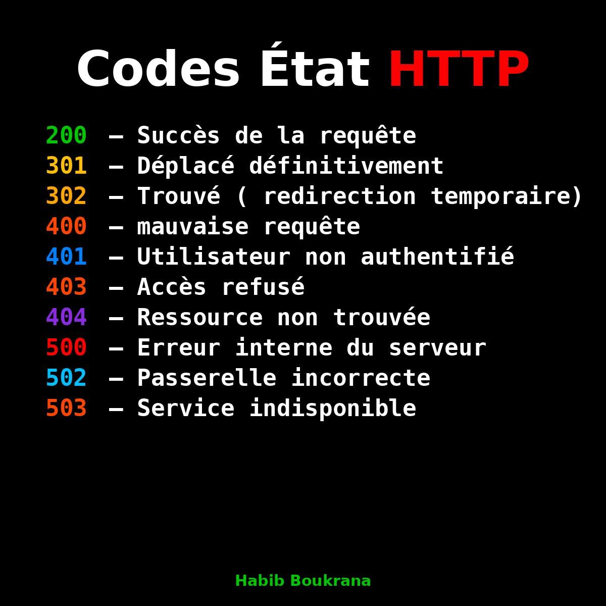

## Docker & Kubernetes - Déploiement & DevOps Q/A

### Q1: Qu'est-ce que Docker et pourquoi l'utiliser ?
**Réponse:**
Docker permet de créer des conteneurs pour isoler et déployer des applications de façon portable et reproductible.

### Q2: Différence entre VM et conteneur ?
**Réponse:**
VM : virtualise tout un OS, plus lourd. Conteneur : partage le noyau, plus léger et rapide.

### Q3: Qu'est-ce que Kubernetes ?
**Réponse:**
Kubernetes est un orchestrateur de conteneurs permettant de gérer le déploiement, la scalabilité et la résilience des applications.

### Q4: Expliquer le concept de pod dans Kubernetes.
**Réponse:**
Un pod est l'unité de base de déploiement dans Kubernetes, regroupant un ou plusieurs conteneurs partageant le même réseau et stockage.

**Q: Why Docker in ML/AI?**  
- Ensures reproducibility, consistency, easy deployment of models.

**Q: Difference between Docker and Kubernetes?**  
- **Docker**: Containerization.  
- **Kubernetes**: Orchestration of containers at scale.

**Q: How to deploy an LLM in Kubernetes?**  
- Build Docker image → push to registry → define K8s deployment (YAML) → expose via service/ingress.
